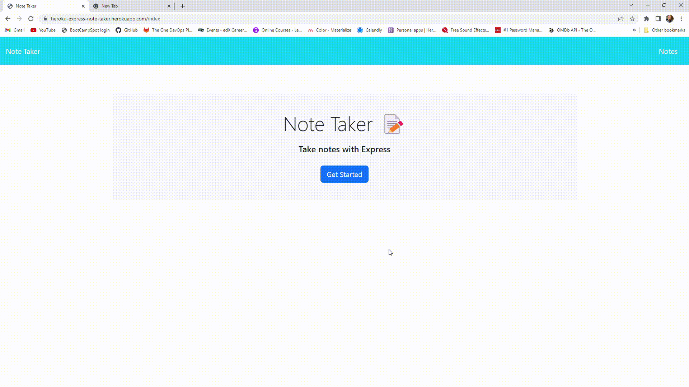

# Express Note Taker

## Description

An application that can be used to write and save notes. It uses an Express.js back end and will save and retrieve note data from a JSON file.

This is my first project utilizing a server.  My initial focus was to build a functioning server with correct pathing functional use of GET, POST, and DELETE methods.  After building the server, I decided to work on separating out the routes to their own folder to clean up the application. Further improvements include separating a class constructor into it's own .js file in the db folder.  While servers and routing can be a challenging topic, it's an important skillset to develop!!

Link: [Express Note Taker (deployed on Heroku)](https://heroku-express-note-taker.herokuapp.com/ 'An application that can be used to write and save notes.')

## Table of Contents

- [Installation](#installation)
- [Usage](#usage)
- [Credits](#credits)
- [License](#license)

## Installation

N/A

## Usage

Click on the link in the description and the Note Taker app homepage will open up.  Press the 'Get Started' button and you will be taken to the Note page.  On the left-hand side will be a list of all the Note Titles that are currently stored.  Click on any of them to bring it up on the main screen on the right and see the note, or on the trashcan to delete the note.  In the top right corner there is a plus sign that will open up a new note form on the right.  Fill in the Note Title and the Note Text then press the plus sign to add that note to the list on the left.  It will be there until deleted.

## Credits

Special thanks to the Web Dev Simplified Youtube channel!
 
Link: [Web Dev Simplified](https://www.youtube.com/@WebDevSimplified 'The Youtube channel for Web Dev Simplified.')

## License

N/A